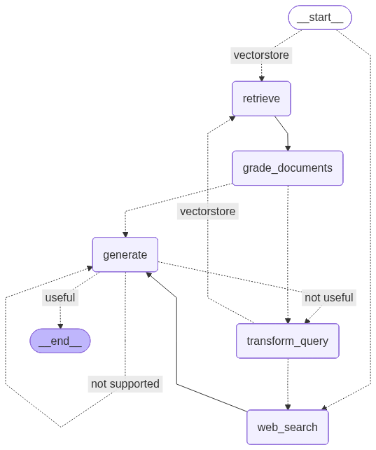

# Intuition-2025: Chat Assistant for Change Management

A specialized AI-powered chat assistant designed to provide expert guidance on change management strategies, models, and best practices. Built using Retrieval-Augmented Generation (RAG) with a knowledge base of academic papers and resources on change management frameworks like Lewin's Model, Kotter's 8-Step, McKinsey 7S, and ADKAR.

## Features

- **Intelligent Routing**: Automatically routes queries to vectorstore (change management), web search (current events), or hybrid (both sources combined).
- **Quality Assurance**: Includes document relevance grading, hallucination detection, and answer usefulness checks.
- **Conversation Memory**: Maintains context across up to 3 conversation turns.
- **Hybrid Search**: Combines historical knowledge base with current web search for comprehensive answers.

## Installation

### Prerequisites

- Python 3.8 or higher
- API keys for:
  - Google Generative AI (Gemini model)
  - Tavily (web search)

### Steps

1. Clone the repository:

   ```bash
   git clone https://github.com/OREO-Intuition-2025/intuition-2025.git
   cd intuition-2025
   ```

2. Install dependencies:

   ```bash
   pip install -r requirements.txt
   ```

3. Set up environment variables:

   ```bash
   # Copy the example file
   cp .env.example .env
   ```

   Then edit `.env` and add your API keys:

   ```
   GOOGLE_API_KEY=your_google_api_key_here
   TAVILY_API_KEY=your_tavily_api_key_here
   ```

4. (Optional) For notebook analysis: Install additional packages:
   ```bash
   pip install pandas scikit-learn transformers kaggle
   ```

## Usage

### Running the Chat Assistant

1. Populate the knowledge base (if not already done):

   ```bash
   python scraper.py
   ```

   This scrapes content from `links.txt` and saves to `knowledge-base/`.

2. Launch the app:
   ```bash
   streamlit run app.py
   ```
   Open the provided URL in your browser. Ask questions like "What is Lewin's change model?" or "How to handle resistance in organizational change?"

### Generating Workflow Graph

To generate a visual diagram of the RAG workflow:

```bash
python generate_workflow_graph.py
```

This creates `workflow_graph.png` showing the complete LangGraph structure with all nodes, edges, and decision points.

### Running Analysis (Notebook)

Open `intuition-change-management.ipynb` in Jupyter and run cells to:

- Analyze change management models via web scraping.
- Recommend models based on role and change context (e.g., "Role: Engineer. Change: AI implementation").
- Fine-tune models on HR datasets for strategy prediction.

## Project Structure

```
intuition-2025/
├── app.py                          # Streamlit web UI entry point
├── src/
│   ├── __init__.py                 # Package initialization
│   ├── config.py                   # Centralized configuration
│   ├── document_processor.py       # Document loading & embedding
│   ├── prompts.py                  # LLM prompt templates
│   └── rag_workflow.py             # LangGraph RAG pipeline
├── scraper.py                      # Script to scrape and build knowledge base
├── generate_workflow_graph.py      # Generate visual workflow diagram
├── intuition-change-management.ipynb  # Notebook for model analysis
├── links.txt                       # List of URLs for scraping
├── requirements.txt                # Python dependencies
├── .env.example                    # Template for environment variables
├── .gitignore                      # Git ignore rules
├── README.md                       # This file
├── STRUCTURE.md                    # Detailed architecture documentation
├── workflow_graph.png              # Generated workflow visualization
├── knowledge-base/                 # Scraped text files (input-*.txt)
└── cache_db/                       # Cached embeddings for performance
```

### Core Modules

- **app.py**: Streamlit interface with caching and error handling
- **src/config.py**: Environment variables, API keys, model settings, paths
- **src/document_processor.py**: `DocumentProcessor` class for loading, splitting, and embedding documents
- **src/prompts.py**: All LLM prompt templates (routing, grading, rewriting)
- **src/rag_workflow.py**: `RAGWorkflow` class implementing LangGraph pipeline with conditional routing

See [STRUCTURE.md](STRUCTURE.md) for detailed architecture documentation.

## RAG Workflow Architecture

The system uses a sophisticated LangGraph state machine to ensure high-quality, grounded responses:



### Workflow Explanation

The graph above shows the complete question-answering pipeline with all decision points and retry loops.

```
                           ┌─────────────┐
                           │   START     │
                           └──────┬──────┘
                                  │
                                  ▼
                      ┌───────────────────────┐
                      │  route_question()     │
                      │  Decision: vectorstore│
                      │  web_search, or hybrid│
                      └───────┬───────────────┘
                              │
                 ┌────────────┴────────────┐
                 │                         │
         vectorstore                  web_search
                 │                         │
                 ▼                         ▼
         ┌──────────────┐         ┌──────────────┐
         │   retrieve   │    ┌────│ web_search   │
         │  (vector DB) │    │    │  (Tavily)    │
         └──────┬───────┘    │    └──────┬───────┘
                │            │           │
                ▼            │           │
    ┌───────────────────────┐│           │
    │  grade_documents      ││           │
    │  (relevance check)    ││           │
    └───────┬───────────────┘│           │
            │                │           │
            ▼                │           │
┌───────────────────────┐    │           │
│ decide_to_generate()  │    │           │
│ Have relevant docs?   │    │           │
└───┬───────────────────┘    │           │
    │                        │           │
    ├─No──► transform_query  │           │
    │       (rewrite question)│          │
    │              │          │           │
    │       ┌──────▼──────────┐           │
    │       │route_after_     │           │
    │       │transform()      │           │
    │       │ (check source)  │           │
    │       └─┬──────────┬───┘           │
    │         │          │               │
    │    vectorstore  web_search        │
    │         │          └───────────────┘
    │         ▼
    │   ┌─────────┐
    │   │ retrieve│
    │   │ (retry) │
    │   └─────────┘
    │
    └─Yes─────────────────┬──────────────┐
                          │              │
                          ▼              │
                  ┌───────────────┐      │
                  │   generate    │◄─────┘
                  │  (Gemini 2.0) │
                  └───────┬───────┘
                          │
                          ▼
            ┌─────────────────────────────┐
            │  Quality Checks:            │
            │  1. Hallucination Detection │
            │  2. Usefulness Evaluation   │
            └──┬──────────────────────────┘
               │
               ├─not supported──► generate (retry)
               │
               ├─not useful──► transform_query ──► route_after_transform
               │                                    (back to source)
               │
               └─useful──► END (return to user)
```

### Detailed Flow Explanation

#### **Entry Point: Question Routing**

- **START** → The workflow begins when a user asks a question
- **route_question()** analyzes the question and decides:
  - **"vectorstore"** → Questions about change management (Lewin, Kotter, resistance, etc.)
  - **"web_search"** → General queries or current events
  - **"hybrid"** → Questions needing both historical knowledge + current trends/events

#### **Path 1: Vectorstore (Change Management Questions)**

1. **retrieve** → Search vector database for relevant document chunks (marks source as "vectorstore")
2. **grade_documents** → LLM evaluates each document's relevance
   - **Relevant docs found?**
     - ✅ **Yes** → Proceed to **generate**
     - ❌ **No** → Go to **transform_query** (rewrite question)
3. **transform_query** → Rewrite question for better retrieval
4. **route_after_transform** → Check source → Loop back to **retrieve** (vectorstore)

#### **Path 2: Web Search (General Questions)**

1. **web_search** → Query Tavily API for current information (marks source as "web_search")
2. Proceed directly to **generate**
3. If answer not useful → **transform_query** → **route_after_transform** → Loop back to **web_search**

#### **Path 3: Hybrid Search (Comprehensive Questions)**

1. **hybrid_search** → Perform both vectorstore retrieval AND web search simultaneously
2. **grade_documents** → LLM evaluates combined document relevance from both sources
   - **Relevant docs found?**
     - ✅ **Yes** → Proceed to **generate**
     - ❌ **No** → Go to **transform_query** (rewrite question)
3. **transform_query** → Rewrite question for better retrieval
4. **route_after_transform** → Check source → Loop back to **hybrid_search**

#### **Answer Generation & Quality Checks**

1. **generate** → Gemini 2.0 creates answer using retrieved context
2. **Quality validation** (two-stage check):

   **Check 1: Hallucination Detection**

   - Is the answer grounded in the retrieved documents?
   - ❌ **No** → Loop back to **generate** (retry)

   **Check 2: Usefulness Evaluation**

   - Does the answer actually address the user's question?
   - ✅ **Yes** → **END** (return answer to user)
   - ❌ **No** → **transform_query** (need different documents)

#### **Retry Mechanisms**

The workflow has intelligent retry loops that **maintain source awareness**:

1. **Document Quality Loop (Vectorstore)**: `retrieve → grade → transform_query → route_after_transform → retrieve`

   - Triggers when no relevant documents found in vectorstore
   - Rewrites vague questions into specific queries
   - `route_after_transform` checks source="vectorstore" and loops back to `retrieve`

2. **Document Quality Loop (Web Search)**: `web_search → generate → usefulness check → transform_query → route_after_transform → web_search`

   - Triggers when web search answer doesn't help
   - Rewrites query for better web results
   - `route_after_transform` checks source="web_search" and loops back to `web_search`

3. **Generation Retry Loop**: `generate → hallucination check → generate`
   - Triggers when answer contains fabricated information
   - Retries generation with same documents and source

**Critical Fix**: The `route_after_transform()` node ensures that retry loops stay within their original source (vectorstore or web_search). Without this, a web search that returns a not-useful answer would incorrectly retry with the vectorstore!

### Why This Design?

- **Adaptive**: Automatically routes questions to appropriate sources
- **Quality-focused**: Multiple validation stages prevent hallucinations
- **Self-correcting**: Loops allow the system to improve its approach
- **Source-aware**: Maintains original source through retry loops (critical for correctness)
- **Transparent**: Each step is logged for debugging and monitoring
- **Resilient**: Handles edge cases (vague questions, missing context, hallucinations)

### Example Execution Flow

**Question: "What is Lewin's change model?"**

```
1. START → route_question()
   ├─ Analysis: "change model" keyword detected
   └─ Decision: vectorstore ✓

2. retrieve()
   └─ Found 4 document chunks about Lewin's model

3. grade_documents()
   ├─ Doc 1: "Lewin's model has three stages..." → Relevant ✓
   ├─ Doc 2: "Kurt Lewin developed..." → Relevant ✓
   ├─ Doc 3: "Bibliography: Lewin, K. (1947)..." → Not relevant ✗
   └─ Doc 4: "Unfreeze, change, refreeze..." → Relevant ✓
   └─ Result: 3 relevant documents

4. decide_to_generate()
   └─ Has relevant docs → generate ✓

5. generate()
   └─ Generated: "Lewin's Change Management Model consists of three
       stages: Unfreeze (preparing for change), Change (implementing
       new processes), and Refreeze (solidifying the changes)..."

6. Quality Checks:
   ├─ Hallucination check: Grounded in documents? YES ✓
   └─ Usefulness check: Answers the question? YES ✓

7. END → Return answer to user
   Total time: ~3 seconds
```

**Question: "How do I make people change?" (vague)**

```
1. START → route_question()
   └─ Decision: vectorstore

2. retrieve()
   └─ Found 4 documents (mixed relevance)

3. grade_documents()
   └─ Result: 0 relevant documents (too vague)

4. decide_to_generate()
   └─ No relevant docs → transform_query

5. transform_query()
   └─ Rewritten: "Strategies for managing resistance to organizational change"

6. retrieve() [Second attempt]
   └─ Found 4 documents about resistance management

7. grade_documents()
   └─ Result: 3 relevant documents ✓

8. generate()
   └─ Generated detailed answer about resistance strategies

9. Quality checks: PASS ✓

10. END → Return improved answer
    Total time: ~5 seconds (included retry)
```

**Question: "What's the weather in NYC?" (web search, not useful answer)**

```
1. START → route_question()
   └─ Decision: web_search (not about change management)

2. web_search() [marks source="web_search"]
   └─ Found 3 web results (but perhaps outdated or unclear)

3. generate()
   └─ Generated: "Weather information for NYC shows..."

4. Quality checks:
   ├─ Hallucination check: Grounded? YES ✓
   └─ Usefulness check: Answers question? NO ✗ (vague/unhelpful)

5. transform_query()
   └─ Rewritten: "Current weather conditions New York City today"

6. route_after_transform()
   ├─ Checks source = "web_search"
   └─ Routes back to: web_search (NOT retrieve!) ✓

7. web_search() [Second attempt with better query]
   └─ Found better, more current results

8. generate()
   └─ Generated improved weather answer

9. Quality checks: PASS ✓

10. END → Return answer
    Total time: ~6 seconds

**Key Point**: Step 6 ensures web search retries use web search,
not the vectorstore (which has no weather data!)
```

## How It Works

1. **Data Collection**: `scraper.py` fetches content from academic URLs in `links.txt` using BeautifulSoup, cleaning and storing text in `knowledge-base/`.

2. **Configuration**: `src/config.py` loads API keys from `.env` and sets up model parameters, file paths, and chunk sizes.

3. **Document Processing**: `src/document_processor.py` loads text files, splits into chunks, generates embeddings (cached in `cache_db/`), and indexes in Chroma vector database.

4. **Prompt Engineering**: `src/prompts.py` provides specialized templates for:

   - Question routing (vectorstore vs web search)
   - Document relevance grading
   - Hallucination detection
   - Answer usefulness scoring
   - Query rewriting for better retrieval

5. **RAG Workflow**: `src/rag_workflow.py` implements the LangGraph state machine shown above with conditional routing, quality checks, and intelligent retry mechanisms.

6. **User Interface**: `app.py` provides a Streamlit chat interface with session management and error handling.

7. **Analysis**: The notebook uses NLP (TF-IDF, Sentence Transformers) and ML to score and recommend change management models based on contextual factors.

## Dependencies

- **Core**: LangChain, LangGraph, Streamlit, Chroma, HuggingFace Transformers
- **Scraping**: BeautifulSoup, Requests
- **AI/ML**: Sentence Transformers, Scikit-learn, Pandas
- **APIs**: Google Generative AI, Tavily

## Contributing

Feel free to open issues or pull requests for improvements, such as adding more models, enhancing the UI, or integrating notebook features into the main app.

## License

This project is for educational purposes. Ensure compliance with web scraping terms and API usage policies.
